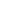

# {style="width:1em;"} Armature Deform

The armature deform modifier is an After Effects version of [Blender's *Armature* modifier](https://docs.blender.org/manual/en/latest/modeling/modifiers/deform/armature.html). It's a **modifier**, not a [constraint](custom.md): a constraint drives the transformation of a layer, this one drives its *geometry* — the Bézier path of a mask or of a shape.

Each vertex of the path follows a trio of bones: one for the point itself, and one for each of its two handles. Where Blender binds a mesh to an armature with skin weights, this one matches the bones to the vertices **by index**: the bone numbered `0` drives the first vertex of the path, `1` the second one, and so on. A vertex the armature has no bones for keeps the shape the path was drawn with, so a partly boned path still works.

## Using it

Draw the path, rig the bones, then:

1. Select the path — the *Mask Path* of a mask, or the *Path* of a shape — in the timeline. Several paths at once is fine.
2. Click {style="width:1em;"} ***Armature Deform...*** in the Links and constraints panel — its own button, below the ***Custom Constraints...*** menu, since it isn't a constraint.
3. Pick the **Composition** holding the bones, type their **Prefix**, **Name** and **Side**, and click ***Armature deform***.

An `Armature Deform` effect is added to the layer to control the modifier, and the path gets the expression which reads the bones. The effect is named `Armature Deform`, and `Armature Deform.001`, `Armature Deform.002`... for the next ones on the same layer: a layer with several deformed paths has one effect per path.

- **Via precomp layer**: check it when the armature is a *precomposition of this composition*, nested through a layer named after it. The bones are then read through that layer's own transform, so moving or scaling the precomp layer moves the deformed path with it. Leave it unchecked when the armature lives in a composition which isn't nested here: the bones are read straight from the composition's own space.
- **Influence**: blends between the path as it was drawn and the deformed one. At `0 %` the modifier does nothing, at `100 %` it fully applies.

Removing the effect removes the modifier, the way a modifier is taken off the stack in Blender: the path goes back to the shape it was drawn with.

!!! note
    The modifier is computed live by an expression on the path: it doesn't need any keyframe, neither on the path nor on the bones, and updates as soon as anything moves.

## Naming the bones

The bones are looked up by name, exactly as Duik names its layers:

```
B < Lashes 0 Point (Head) > [L]
  │   │     │ │              │
  │   │     │ │              └── Side
  │   │     │ └───────────────── the part of the vertex this bone drives
  │   │     └─────────────────── the index of the vertex, from 0
  │   └───────────────────────── Name
  └───────────────────────────── Prefix
```

- **Prefix** is what every name starts with, **spaces included**. Duik names its bones `B < Name >`, so the prefix is `B < ` — mind the trailing space.
- **Name** is shared by every bone of the path, without its index and its side.
- **Side** is written between brackets at the end of the name: `L`, `R`... Leave it empty for bones with no side.

Each vertex needs three bones, named after the part of it they drive:

| Bone | Drives |
|---|---|
| `<Prefix><Name> <i> Point (Head) >[ Side]` | the vertex itself |
| `<Prefix><Name> <i> Handle Left (Tail) >[ Side]` | its *in* tangent |
| `<Prefix><Name> <i> Handle Right (Tail) >[ Side]` | its *out* tangent |

Only the anchor point of each bone is read, so the rotation and the scale of a bone move its handles rather than turning them in place — as they would on a mesh.

### Checking and changing the armature

Select a deformed path and click ***Refresh*** at the top of the panel: the composition and the names of the bones the modifier reads are shown in the fields, so you can check a rig without opening the expression. Changing them and clicking ***Armature deform*** again points the same modifier at the new bones, keeping its effect and its settings.

!!! note "Why the bones aren't in the effect"
    For the same reason a constraint's target isn't: no After Effects effect parameter type holds a name, and effect parameters can't be renamed — see [choosing the target](custom.md#choosing-the-target). Duik writes the armature in the expression instead, on a single line keyed by the name of the effect:

    ```js
    var DUIK_ARMATURE_DEFORM = {fx:"Armature Deform",comp:"RIG Lashes.L",prefix:"B < ",bone:"DEF Lashes A",side:"L"};
    ```

    That line is plain enough to edit by hand if you'd rather retarget that way.

!!! warning
    The bones are found by name, and the key is the name of the effect. So: don't rename the `Armature Deform` effects, and set the armature again after renaming its composition or its bones. Give your compositions unique names too — an expression reaches a composition only by name.

## Differences with Blender

- **Indices, not skin weights.** Blender binds a mesh to an armature by vertex group or by envelope, and blends the bones influencing each vertex. A Bézier path has no such data, and an expression has nowhere to store a weight per vertex, so each vertex is driven by the bones bearing its own number, with no blending. Insert or remove a vertex and the numbering shifts: add or rename the bones to match.
- **Three bones per vertex.** A path vertex is a point and two handles, where a mesh vertex is a single location. Handles get their own bones so a curve can be shaped, not only moved.
- **In the plane of the path.** Only the *X* and *Y* of each bone are used. The depth of a 3D bone is dropped: a path is flat.
- **No bone envelopes, no *Preserve Volume*, no multi-modifier.** All three need weights or a mesh volume, neither of which exists here.
- **The path's own space.** The bones are converted into the space of the layer holding the path. A shape inside a group with its own transform is deformed in the layer's space, not the group's — keep the transform of the containing groups at their default, or use a mask.
