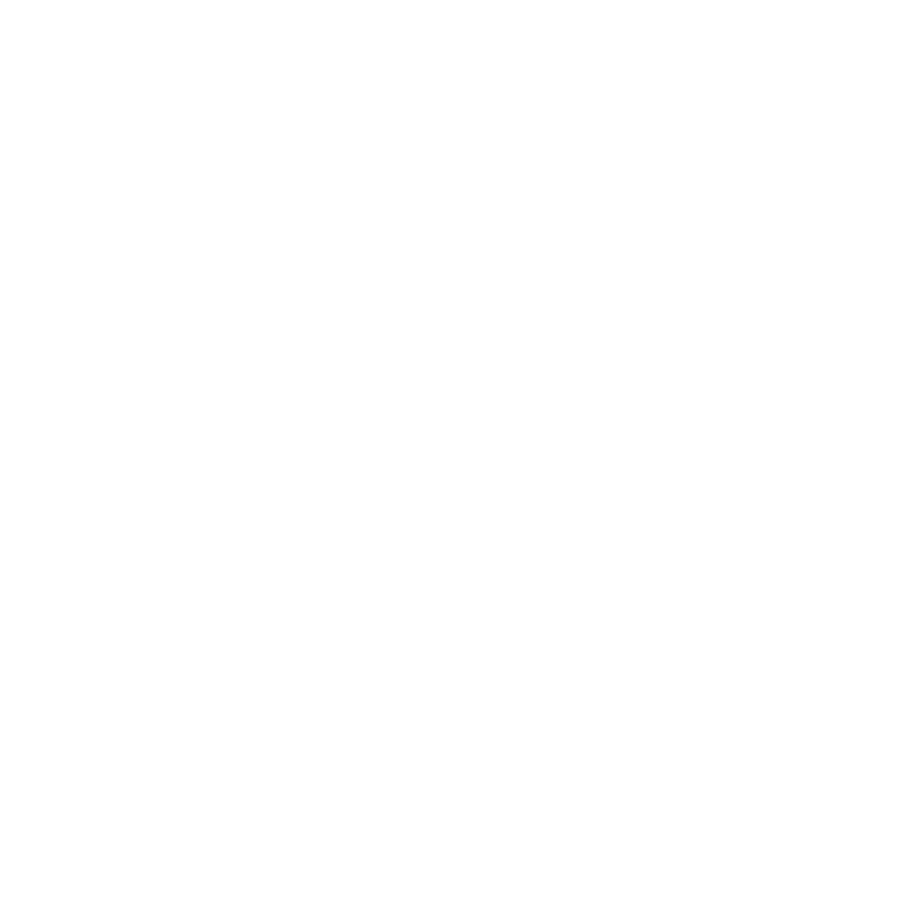
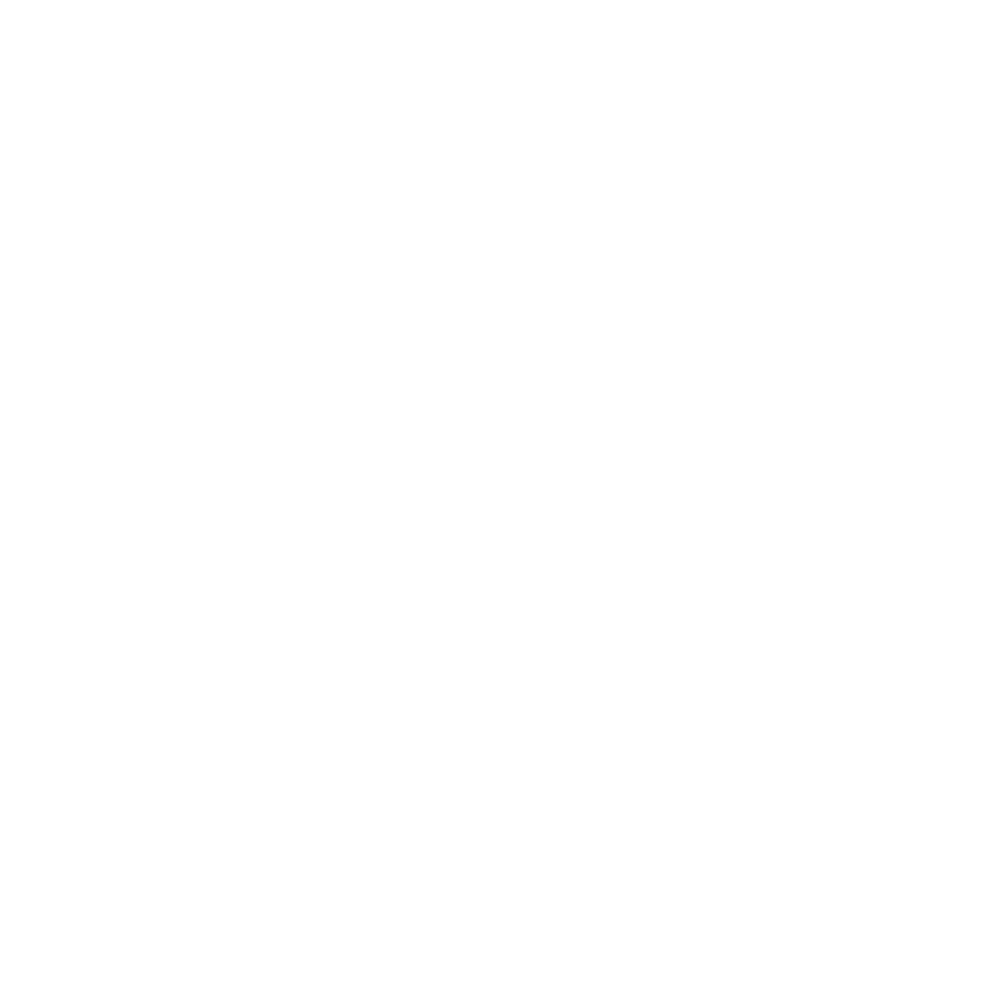

# {style="width:1em;"} Transform Constraints

Transform constraints can constrain (i.e. link) the position and rotation of a layer to follow the location and orientation of other layers and Bézier paths.

They're very useful to rig all kinds of machines, cogs, or also cloths, for example when used with puppet pins or Bézier paths and [Duik pins](pins.md)&nbsp;[^1], constrained to the orientation or location of the limbs and joints.

_(14597187638).png){style="max-height:720px;"}  
*Elementary treatise on the finishing of white, dyed, and printed cotton goods  
Joseph Depierre, 1889  
Public domain.*{style="font-size:0.8em;"}

Most of the time, the same effect can be obtained with the connector, but with un-bounded values. Using constraints is also easier when there are multiple master layers.

Select the layers to constrain then click the **{style="width:1em;"} *Transform...*** button to select the constraint to apply to the selection.


!!! tip
    When a layer is constrained, its rotation and position are not locked; you can still edit and animate them manually and offset the constrained value.

# {style="width:1em;"} Position Constraint

You can constrain the position of a layer to the location of other layers; that means the constrained layer will translate according to the absolute location of the other layers, taking all parent translations into account. The weight[*](../../misc/glossary.md) acts as a multiplier of the constraint and can be animated.  
For example, if a layer is constrained to two other layers with both weights at `50 %`, it stays in the center of the segment joining the two other layers. That also works with three layers and `33.3 %`, to attach the layer to the center of mass of the layers. Of course you can adjust the weights to change the "*mass*" of the master layers.

You can use the effect to adjust and animate the position constraint.


Just select the layer to constrain to, and set or animate its weight. To constrain to multiple layers, you can duplicate the effect.

!!! note
    Because this constraint depends on the specific location of the layers at the beginning of the composition, you won't see the effect of the position constraint until there's an actual animation (using keyframes or expressions) on the master layers, and at the very first frame of the composition.

## {style="width:1em;"} Copy Location

This is an After Effects version of [Blender's *Copy Location* constraint](https://docs.blender.org/manual/en/latest/animation/constraints/transform/copy_location.html). Where the position constraint above *adds* the movement of the master layers to the layer's own position, the copy location constraint *replaces* the location of the layer with the location of its target, one axis at a time.

Select the layers to constrain and click {style="width:1em;"} ***Copy Location***, then set its target in the ***Constraint settings***. The effect is named `Copy Location`, and `Copy Location.001`, `Copy Location.002`... for the next ones on the same layer.

- **Target**: picked in the Duik panel, not in the effect — see [choosing the target](#choosing-the-target). It can be a layer of any composition of the project.
- **Transform units**: how the coordinates of the target composition are read into this one.
    - ***Pixels*** uses them as they are, one pixel for one pixel.
    - ***Percentage*** reads the target's position as a share of its own composition and applies it to this one, so the centre of a `960 x 540` comp lands on the centre of a `1920 x 1080` one. Resolution stops mattering.
    - ***Custom ratio*** multiplies the coordinates by the **Custom ratio** value — set it to `4` for one pixel in the target composition to become four here.
- **Axis**: check **X**, **Y** and **Z** to choose which axis are copied; the others keep the value of the layer. **Invert X**, **Invert Y** and **Invert Z** negate the copied coordinate, mirroring the target around the origin of the space.
- **Offset**: when checked, the location of the layer is added to the copied location instead of being replaced by it. This is what keeps the relative placement of a layer while it follows its target.
- **Target space** and **Owner space**: the space the location of the target is read in, and the space it is written to.
    - ***World Space*** is the composition, with every parent transformation applied.
    - ***Custom Space*** is relative to the layer set in **Custom space**, so a layer can be constrained inside the coordinates of any other layer.
    - ***Local Space*** is relative to the parent of the layer (of the target for the target space, of the constrained layer for the owner space). A layer without a parent is already in world space.
- **Influence**: blends between the original location of the layer and the constrained one, in world space. At `0 %` the constraint does nothing, at `100 %` it fully applies.

You can duplicate the effect to stack several copy location constraints on the same layer: they're evaluated from top to bottom, each one starting from the result of the previous one, exactly like the constraint stack of Blender.

!!! note
    The constraint is computed live by an expression: it doesn't need any keyframe, neither on the layer nor on its target, and updates as soon as anything moves.

!!! tip
    Axis are the axis of After Effects, not of Blender: **Y** goes *down* the composition and **Z** goes *away* from the camera. On a 2D layer, the **Z** options are simply ignored.

### Choosing the target

The target is set in the ***Constraint settings***, opened with the {style="width:1em;"} gear button in the toolbar at the top of the panel. As in Blender, the settings work on one constraint at a time, the *active* one. Select its effect in the *Effect Controls* panel or in the timeline (selecting one of its parameters works too): the settings show its name, its layer and what it currently points at, so you can check a rig without opening the expressions. When several constraint effects are selected, the last one is shown. Pick a **Target Composition** and a **Target Layer**, and click ***Set target*** to point that constraint at the layer; the other constraints keep their own targets.

A newly created constraint has no target and does nothing until you set one. As in Blender, it becomes the active constraint when it's created, so opening the settings shows it right away.

!!! tip
    The constraint settings can also live in their own panel, docked anywhere in the After Effects interface: click {style="width:1em;"} ***Pop out*** at the top of the settings, or `[Alt] + [Click]` the gear button. This launches the *Duik Constraint Settings* panel, which has to be [installed](../../getting-started/install.md) like the other Duik panels.  
    After Effects doesn't tell scripts when the selection changes, so click ***Refresh*** to show the newly selected constraint. Until then, ***Set target*** keeps working on the constraint shown.

!!! note "Why the target isn't in the effect"
    Because After Effects can't put it there. No effect parameter type holds a name — the whole set is layer, slider, angle, checkbox, colour, point, drop down, group and button — and effect parameters can't be renamed, so a parameter can't display one either. A layer control would be no help: it only ever lists the layers of its own composition. A name can live in one place only, the expression, so that's where Duik writes it, in a `DUIK_TARGETS` line keyed by the name of the effect:

    ```js
    var DUIK_TARGETS = {"Copy Location":["Character","Head"],"Copy Location.001":["Props","Hat"]};
    ```

    That line is plain enough to edit by hand if you'd rather retarget that way.

!!! warning
    The target is found by name, and the key is the name of the effect. So: don't rename the constraint effects, and set the target again after renaming a target composition or a target layer. Give your compositions unique names too — an expression reaches a composition only by name.

!!! note
    When the target is in another composition, its position and rotation are read in *that composition's* space; the constraint doesn't know how, or whether, that composition is nested into this one. **Transform units** on the copy location constraint is there to map the coordinates the way you want. If you need a layer to follow a precomp's content through the precomp layer's own transform, use [parent across compositions](parent.md) instead, which is built for that.

### Applying a constraint

As in Blender, a copy location or copy rotation constraint can be *applied*: its result becomes the actual position or rotation of the layer, and the constraint is removed.

Select the constraint effects, in the *Effect Controls* panel or in the timeline (selecting one of their parameters works too), and click {style="width:1em;"} ***Apply Constraint*** in the toolbar at the top of the panel.

- The constraint is evaluated at the **current time** only: if its target moves later on, the layer doesn't follow it anymore.
- If the position or rotation is **animated**, the value is set with a keyframe at the current time, just like when editing an animated value by hand. A constraint which doesn't change the value — no target, a disabled effect, an influence of `0 %` — is simply removed, without adding a keyframe.
- When the last constraint of its kind is applied, its expression is removed too, and the property is free again.

!!! warning
    The constraint is evaluated **alone**, on the unconstrained value of the layer; the other constraints stay in place. Applying the first constraint of a stack keeps the layer where it is, but applying one further down may move it, because the constraints above it now start from its result instead of the other way around. Blender behaves the same way.  
    To apply a whole stack, select all of its effects: they're applied from top to bottom, and the layer doesn't move.

## {style="width:1em;"} Orientation Constraint

You can constrain the rotation of a layer to the orientation of other layers; that means the constrained layer will rotate according to the absolute orientation of the other layers, taking all parent rotations into account. The weight[*](../../misc/glossary.md) acts as a multiplier of the constraint and can be animated.

  
*Léa Saint-Raymond  
All rights reserved.*{style="font-size:0.8em;"}

This is a very useful tool when you need a layer to stay always aligned with another layer, without translating with it.  
You can also use this constraint to link the orientation of a controller to the orientation of any layer in the rig, this is a quick and easy way to control rotations in a rig, without parenting.

You can use the effect to adjust and animate the orientation constraint.


Just select the layer to constrain to, and set or animate its weight. To constrain to multiple layers, you can duplicate the effect.

!!! tip
    When all orientation constraints are set to `0 %`, the constrained layer keeps its own orientation no matter what, even if it has a parent. That's an easy way to rig the gondolas of a ferris wheel for example, or the pedal of a bicycle.

## {style="width:1em;"} Copy Rotation

This is an After Effects version of [Blender's *Copy Rotation* constraint](https://docs.blender.org/manual/en/latest/animation/constraints/transform/copy_rotation.html), the companion of the [copy location constraint](#copy-location) above. Where the orientation constraint adds a weighted share of the master layers' orientation, this one combines the rotation of the layer with the rotation of a single target using Blender's mix modes.

Select the layers to constrain and click {style="width:1em;"} ***Copy Rotation***, then set its target in the ***Constraint settings***. The effect is named `Copy Rotation`, and `Copy Rotation.001`, `Copy Rotation.002`... for the next ones on the same layer.

- **Target**: picked in the Duik panel, not in the effect — see [choosing the target](#choosing-the-target). It can be a layer of any composition of the project.
- **Invert**: negates the copied rotation.
- **Mix mode**: how the copied rotation is combined with the layer's own rotation.
    - ***Replace*** discards the rotation of the layer and uses the target's.
    - ***Add*** adds the two rotations together.
    - ***Before Original*** and ***After Original*** apply the copied rotation as if the target were respectively a parent or a child of the layer.
    - ***Offset (Legacy)*** reproduces Blender's old *Offset* checkbox: it adds the two rotations and then inverts the total, instead of inverting only the copy.
- **Target space** and **Owner space**: the space the rotation of the target is read in, and the space it is written to — ***World Space*** (the composition, every parent applied), ***Custom Space*** (relative to the layer set in **Custom space**) or ***Local Space*** (relative to the parent of the layer; a layer without a parent is already in world space).
- **Influence**: blends between the original rotation of the layer and the constrained one. At `0 %` the constraint does nothing, at `100 %` it fully applies.

You can duplicate the effect to stack several copy rotation constraints on the same layer: they're evaluated from top to bottom, each one starting from the result of the previous one, exactly like the constraint stack of Blender.

!!! note
    The constraint is computed live by an expression: it doesn't need any keyframe, neither on the layer nor on its target, and updates as soon as anything moves.

!!! tip
    Negatively scaled parents are handled: a layer under a mirrored parent copies the rotation as seen on screen, and a vertically flipped parent turns it the right way up.

### Differences with Blender

- **Only the Z axis.** After Effects drives each rotation axis as a separate property, and the whole rotation model of Duik works around the Z axis — the *Rotation* property of a layer, which is *Z Rotation* on a 3D layer. Blender's **Copy X**, **Copy Y** and **Copy Z** checkboxes are therefore not offered; unchecking Z would only disable the constraint, which the **Influence** does better. The *Orientation* of a 3D layer is read as part of its rotation, but is left untouched — the constraint writes to *Z Rotation* only.
- Because rotations around a single axis add up, **Add**, **Before Original** and **After Original** give exactly the same result here. They're all listed anyway, so a rig ported from Blender can keep the mode it was built with. **Replace** and **Offset (Legacy)** do differ.
- There's no **Transform units** here: a rotation is an angle, so it carries over between compositions of any size unchanged.
- The influence blends the two angles **linearly**, where Blender interpolates the rotation matrices and so always takes the shortest way round. Linear blending keeps the winding of the angle, which is what an After Effects rig needs — a wheel that has turned three times keeps its three turns instead of snapping back.

## {style="width:1em;"} Path Constraint

To make a layer follow a Bézier path (and stay aligned with it), you can use the path constraint. It constrains both the position and the rotation of the layer.

_(14597187638)_2.png){style="max-height:720px;"}  
*Elementary treatise on the finishing of white, dyed, and printed cotton goods  
Joseph Depierre, 1889  
Public domain.*{style="font-size:0.8em;"}

1. Click the {style="width:1em;"} ***Path Constraint*** button.  
    
2. **Select the path** property (be careful not to select the group containing the path, but the actual path property).
3. **Click the {style="width:1em;"} eye dropper** button.  
    
4. **Select the layer** to constrain.
5.  **Click the {style="width:1em;"} Path constraint** button.  
    You can `[Alt] + [Click]` to automatically move the constrained layer to the first point of the path.

You can use the effect to adjust and animate the path constraint.


- You can **move the layer along the path** with the first percent value; you can easily loop the animation as this value is not limited to `0 - 100 %`.
- You can offset the layer away from the path, along the normal at the corresponding percent along path, with the **Path Offset** property.
- By default, the layer is rotated to stay tangent to the path. Uncheck the **Orientation** option to disable this.

!!! tip
    If the path itself is animated, the constrained layer will follow the animation of the path, even when the *percent along path* is animated.

_(14780753041).png){style="max-height:720px;"}  
*Elementary treatise on the finishing of white, dyed, and printed cotton goods  
Joseph Depierre, 1889  
Public domain.*{style="font-size:0.8em;"}

[^1]: *cf.* *[Constraints](index.md) / [Pins](pins.md)*.


