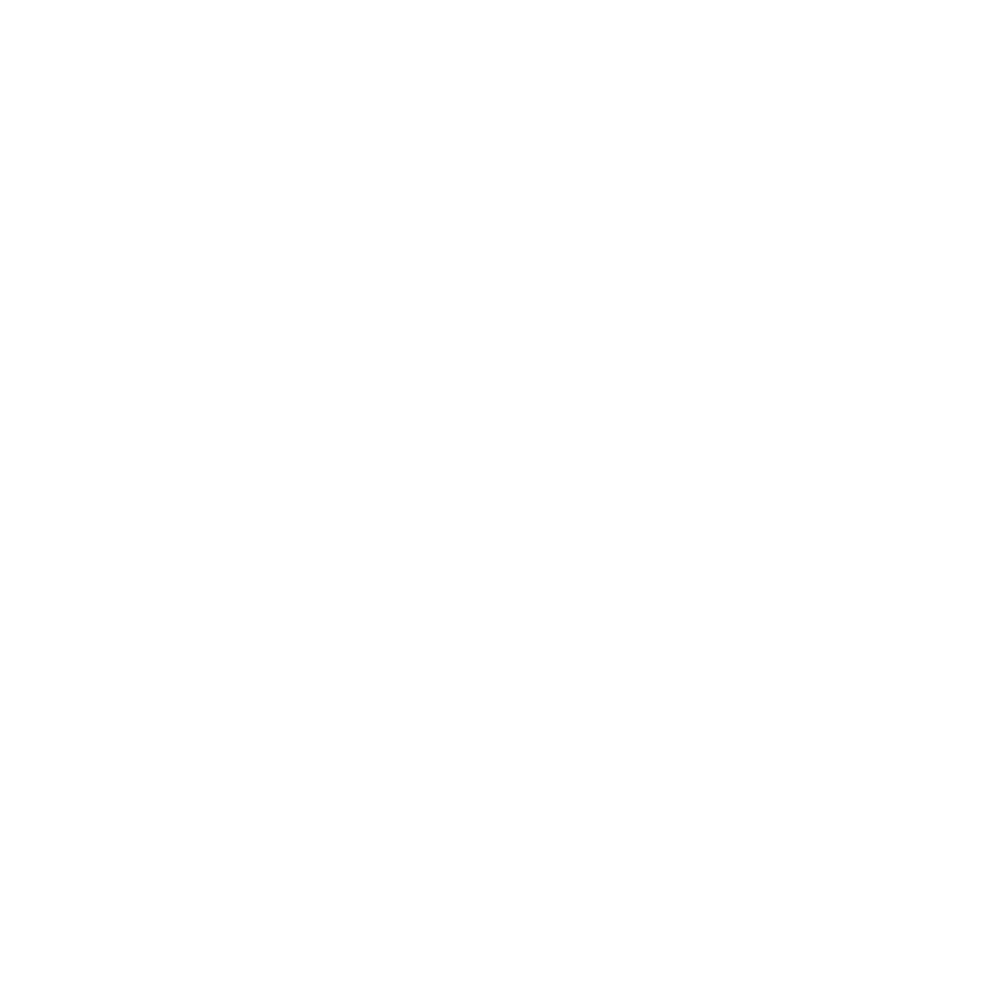

# {style="width:1em;"} Path Spreadsheet

The path spreadsheet shows the **geometry of Bézier paths** in a table, the way Blender's *Spreadsheet* editor shows the geometry of the active object: each vertex of the paths, with its handles, each path, and the feather points of masks, with their values at the current time.

Unlike Blender's, it can also **edit** them: slide or type a value in the table to change the path.

It's handy to check what a path really holds before rigging it: how many vertices it has and in what order, which is what the [armature deform](../../constraints/armature-deform.md) and the [copy point constraints](../../constraints/custom.md) index them by, or to compare a path imported from Blender with Blender's own spreadsheet.

## Opening it

Click {style="width:1em;"} ***Path Spreadsheet*** in the tool bar of the Controllers panel. It opens in place of the controllers; the {style="width:1em;"} button at the top brings them back.

A spreadsheet needs room: `[Alt] + [Click]` the button to launch the *Duik Path Spreadsheet* panel instead, which can be docked anywhere in the After Effects interface. It has to be [installed](../../../getting-started/install.md) like the other Duik panels.

## What it shows

Click ***Refresh*** at the top of the spreadsheet to read the selection of the active composition:

- The **selected paths**: select the *Path* of a shape or the *Mask Path* of a mask in the timeline, or the shape path or the mask holding it. Several paths at once is fine, even in different layers.
- When no path is selected, **all the paths of the selected layers**: the paths of their shapes, whatever group they're in, then their masks. Like Blender, which shows the whole active object.

The paths are read at the **current time**. The line above the table tells what's shown: the layer and the path, or how many there are.

The spreadsheet doesn't follow the selection by itself: After Effects doesn't tell scripts when the selection changes, so it's read again each time you refresh. The **values** of the paths shown are kept up to date, though: they're read again when the pointer comes over the table and when a key is released in the panel. After an undo, a change in the timeline or a move of the time cursor, the table shows the new values as soon as you're back over it.

### Pin

Click {style="width:1em;"} ***Pin*** to keep showing the same paths, like the pin of Blender's spreadsheet: refreshing then reads these paths again at the current time, whatever is selected. Unpin to read the selection again.

### Evaluated and Original

Like Blender's spreadsheet, it can show the paths two ways:

- **Evaluated**: the paths as After Effects draws them, with their expressions. This includes Duik's modifiers, the [armature deform](../../constraints/armature-deform.md) and the [pose shape interpolator](../../constraints/pose-shape-interpolator.md), which are expressions on the paths, the way Blender's evaluated object includes its modifiers.
- **Original**: the paths without their expressions, as they're drawn or keyed.

## Domains

The drop down on the left picks what a row of the table is, like the *Domain* list of Blender's spreadsheet, and tells how many rows each one has. The first column is the index of the row.

The values of all the paths follow each other in one table, like the splines of a curve object in Blender: the vertices of the second path come after the ones of the first one. The ***Spline*** domain tells where each path starts.

Columns named like Blender's attributes hold the same values as in Blender, so both spreadsheets can be compared. Hover the name of a column to read what it is, and a number to read all its decimals.

Each attribute has its own column, between two lines; the values of a vector, like the *x* and *y* of a position, share the column of their attribute. The table shows the rows which fit in the panel: scroll with the scroll bar on its right, or with the arrow keys while editing a value. When the attributes don't all fit either, a scroll bar at the bottom shows the others.

### {style="width:1em;"} Control Point

A row for each vertex of the paths.

| Column | Value | After Effects |
|---|---|---|
| **position** | The vertex. | `vertices` |
| **handle_left** | The handle towards the previous vertex, where it is. | `vertices + inTangents` |
| **handle_right** | The handle towards the next vertex, where it is. | `vertices + outTangents` |
| **in_tangent** | The handle towards the previous vertex, from the vertex. | `inTangents` |
| **out_tangent** | The handle towards the next vertex, from the vertex. | `outTangents` |

Blender keeps where the handles *are*, After Effects where they *point to* from their vertex: both are shown.

### {style="width:1em;"} Spline

A row for each path.

| Column | Value | After Effects |
|---|---|---|
| **Name** | Where the path is, like `Contents / Group 1 / Path 1` or `Masks / Mask 1`. With paths from several layers, the name of the layer comes first. | |
| **cyclic** | Whether the path is closed. | `closed` |
| **Point Start** | The index of its first vertex in the *Control Point* domain. | |
| **Point Count** | The number of its vertices. | `vertices.length` |

### {style="width:1em;"} Feather Point

A row for each feather point of the masks. Blender has no such thing: After Effects keeps the feather points of a mask in its path. Shape paths don't have any.

| Column | Value | After Effects |
|---|---|---|
| **segment** | The vertex starting the segment the feather point is on, as its index in the *Control Point* domain. | `featherSegLocs`, plus the *Point Start* of the mask |
| **factor** | Where it is on the segment, from `0` at its start to `1` at its end. | `featherRelSegLocs` |
| **radius** | The feather amount, negative for an inner feather point. | `featherRadii` |
| **tension** | The tension, from `0` to `1`. | `featherTensions` |
| **corner_angle** | How round the feather is around a corner, in percent: `0` for 0°, `100` for 180°. | `featherRelCornerAngles` |
| **hold** | Whether its interpolation is *Hold*. | `featherInterps` |
| **inner** | Whether it's an inner feather point. | `featherTypes` |

## Editing values

The values which can be edited are **blue**, like the values of the After Effects timeline.

- **Slide** a value: drag it left or right, like in the timeline or in Blender. Hold `[Shift]` to slide ten times faster, `[Ctrl]` (`[Cmd]` on macOS) ten times slower. Coordinates change by one pixel for each pixel dragged, values going from 0 to 1 by a hundredth. The table shows the value as it slides, and the path is changed when you let go, in a single undo step.
- **Step** a value: like in Blender, the value under the pointer shows {style="width:0.6em;"} and {style="width:0.6em;"} arrows on its sides. Click them to take away or add `1`, or `0.1` for *factor* and *tension*, which go from 0 to 1. `[Shift]` and `[Ctrl]` (`[Cmd]` on macOS) work like when sliding. Each click is a single undo step.
- **Type** a value: click it without dragging, type a new one, and press `[Enter]` or click elsewhere. `[Enter]` and the up and down arrows go on to the same value in the row below or above, `[Escape]` cancels.

Keep the pointer over the table while sliding: the slide ends where it leaves the table.

- The path is changed **at the current time**, like typing a value in the timeline: when it's animated, it gets a keyframe at the current time.
- Moving a **position** moves its handles with it, like After Effects does. A **handle_left** or **handle_right** is set where it is: its tangent is worked out from the vertex.
- **Check boxes** (*cyclic*, *hold*) are clicked to change them.
- *factor* and *tension* stay between `0` and `1`, *corner_angle* between `0` and `100`.
- What isn't a value of the path can't be edited: the names, the indices (*Point Start*, *Point Count*, *segment*) and the side of a feather point (*inner*).

Some paths are **read only**: their values aren't blue, and can't be slid or typed. The footer tells how many.

- The paths of **locked layers**.
- The paths with an **expression**, when the *Evaluated* values are shown: they're computed by the expression. Show the *Original* values to edit the path under the expression; this is also how to edit the rest shape of a path deformed by one of Duik's modifiers.

## Differences with Blender

The spreadsheet follows Blender's as closely as After Effects allows. What it can't do:

- **The values are 2D**, and in the space of the path itself, as After Effects keeps them: the space of its shape group, or of its layer for a mask. Blender shows the local space of the object too.
- **Handle types** (*Free*, *Aligned*, *Vector*, *Automatic*) don't exist in After Effects: there are no *handle_type_left* and *handle_type_right* columns. After Effects' tangents are shown instead.
- **The values can be edited**, which Blender's spreadsheet doesn't do.
- **The table scrolls with its scroll bars** and the arrow keys: After Effects doesn't tell scripts about the mouse wheel. Columns can't be resized or reordered.
- **There's no *Selected Only* filter**: After Effects doesn't tell scripts which vertices are selected. There are no row filters either.
- **It isn't live**: the values are read again when the pointer comes over the table, and the selection when you refresh.
- **The composition isn't updated while a value slides**, only when it's let go: After Effects closes an undo group at the end of each event a script handles, so updating it on the way would leave an undo step for every move of the mouse.
- **There's no *Viewer Node* state**: After Effects has no geometry nodes.

Like in Blender, numbers are aligned to the right, floats are shown with three decimals, and integers grouped by thousands.
